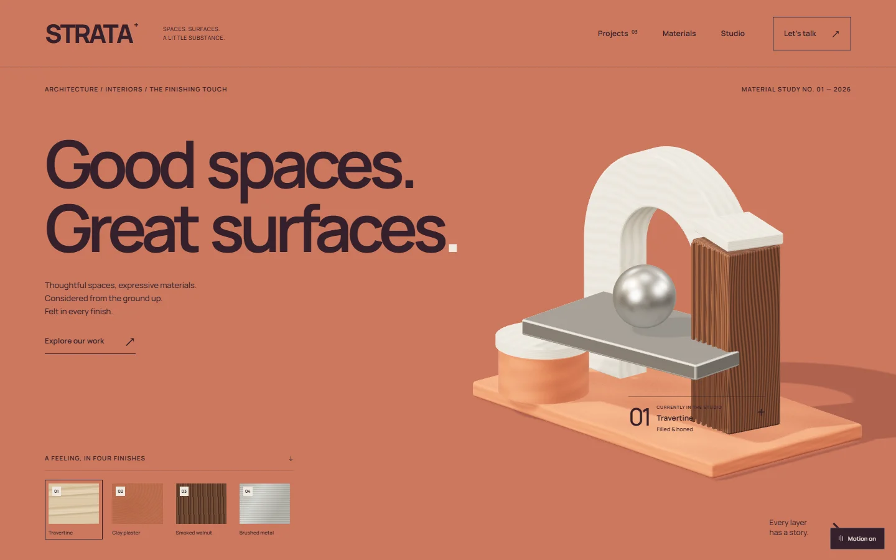
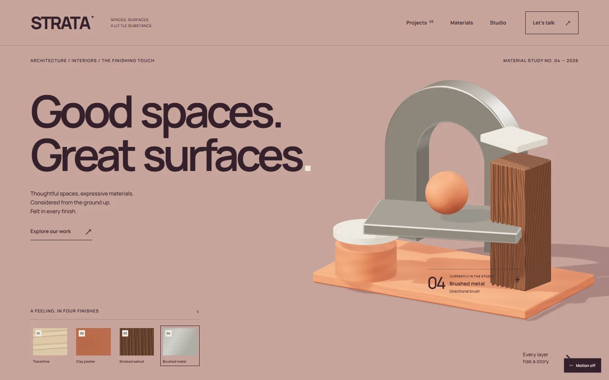

# STRATA

## Website and source

[Live website](https://19-strata.williamking.workers.dev) · [Public source](https://github.com/WilliamHenryKing/19-strata) · [Verification](docs/VERIFICATION.md) · [Release](docs/RELEASE.md)



An independent fictional architecture, interiors and finishing portfolio. React, TypeScript, Three.js, GSAP, Vite and Tailwind. Clay-and-plum editorial design with an original interactive material sculpture, three project studies and a local brief builder.

## Develop and verify

```powershell
bun install --frozen-lockfile
bun run dev
bun run typecheck
bun run lint
bun run build
bun run preview
```

Development is loopback-only at `http://127.0.0.1:4529`, strict port. Preview uses `4629`. Exact local dependencies are pinned; no shared runtime imports or external font/image requests. Coordinate resource-heavy jobs with the collection root. Root owns authorized public GitHub/Cloudflare deployment.

## Edit

| File | Purpose |
| --- | --- |
| `src/data.ts` | Materials, project stories and process copy |
| `src/App.tsx` | Routes, navigation, pages and local brief |
| `src/MaterialScene.tsx` | Original geometry, textures, lighting, motion, cleanup and diagnostics |
| `src/styles.css` | Typography, colours, responsive layout and fallback |
| `public/images/` | Optimized generated concept interiors |
| `ASSETS.md` | Asset provenance and font licence |

Routes: `#/`, `#/work`, `#/work/the-courtyard-house`, `#/work/a-place-to-gather`, `#/work/the-quiet-corner`, `#/materials`, `#/materials/walnut`, `#/studio`, `#/brief`. A material-start brief link uses `#/brief?material=clay`.

The brief form previews and downloads a UTF-8 text file on the current device. No server, sending endpoint, contact field, analytics or form-data storage. Only the animation preference uses localStorage (`strata-motion`).

Read `DESIGN.md` for direction and `HANDOFF.md` for verification. Fictional concepts and generated imagery are not evidence of real commissions.

## Interactive study


